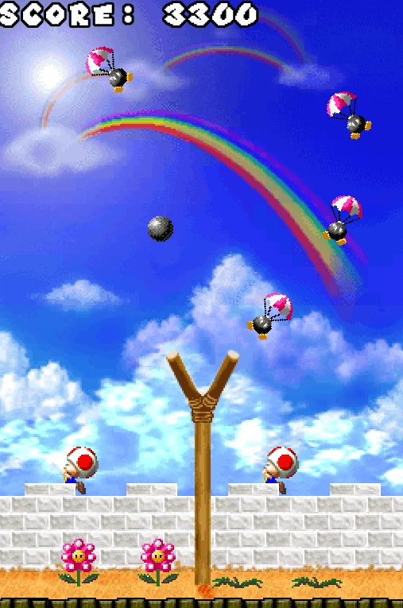

# Bob-omb Squad
This game is also available on the [Devcade project!](https://devcade.csh.rit.edu/). Check out that branch [here](https://github.com/Nate-Teall/Bobomb-Squad/tree/devcade).

This is a recreation of the Bob-omb Squad minigame from Super Mario 64 DS. It is written in C#, using the Godot game engine.
The objective of the game is to use the slingshot in the center to hit the falling bob-ombs before they reach the flowers at the bottom of the screen. This was a quick 3-day project to teach myself Godot and get some more practice with C#. 

## Playing the game
To play the game, simply go to the releases tab, and download the "Windows_v1-0.zip" file. Extract it and launch "Bob-omb Squad.exe"

To use the slingshot, click and drag the cannonball in the center. To mute the audio, press M.

Thanks for reading!